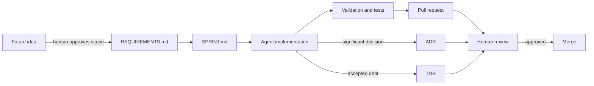

# AI-First Software Project Framework

A lean, Markdown-first repository framework for software products built by humans working with AI coding agents.

The framework keeps the parts of formal systems engineering that remain useful at software-factory speed: clear requirements, measurable acceptance criteria, architecture context, explicit human decisions, technical-debt visibility, validation, traceability, and human approval before merge. It deliberately avoids document-per-requirement and document-per-test bureaucracy.

## Core workflow



**Human approval is the control point.** Agents may propose changes, draft ADRs/TDRs, implement approved requirements, run validation, and prepare pull requests. They do not autonomously merge changes under the current operating model.

## Source of truth

| File | Purpose |
|---|---|
| `REQUIREMENTS.md` | Approved product scope. Requirements and acceptance criteria live together. |
| `FUTURE_WORK.md` | Unapproved ideas, deferred scope, and possible future requirements. |
| `SPRINT.md` | The currently planned sprint: goals, features, requirement IDs, and definition of done. |
| `docs/ARCHITECTURE.md` | One lean arc42-style architecture document with C4-inspired views where useful. |
| `docs/adr/` | Significant architecture/technical decisions that humans must be aware of. |
| `docs/tdr/` | Intentionally accepted technical debt. |
| `AGENTS.md` | Operating instructions and guardrails for AI agents. |
| `docs/AGENT_READINESS.md` | Tool-neutral Level 3 agent-readiness target and bootstrap checklist. |

## Requirement model

Requirements use simple stable IDs such as `REQ-001`. There is no system/software split.

Group requirements by product feature. Keep each requirement atomic and testable. Put acceptance criteria directly under the requirement. Link executable tests once they exist instead of creating separate Markdown test-case documents.

Example:

```markdown
## Feature: Authentication

### REQ-001 - Authenticate a registered user

**Requirement**

The product shall allow a registered user to authenticate with supported credentials.

**Acceptance criteria**

- Valid credentials authenticate successfully.
- Invalid credentials do not authenticate.
- Authentication failures do not disclose whether an account exists.

**Verification**

- `tests/...` once the implementation stack and test layout are selected.
```

## Scope flow

`FUTURE_WORK.md` is the parking lot for ideas. An agent may record a newly discovered idea there, but it must not silently implement it or promote it into approved scope.

When a human approves an item:

1. Create one or more `REQ-###` entries in `REQUIREMENTS.md`.
2. Add the relevant requirement IDs to the current or a future sprint.
3. Create/link the work item required by the team's issue-tracking process.
4. Implement from the approved requirement and acceptance criteria.
5. Remove the future-work item or mark it as promoted, preserving the Git history.

## Sprints and features

Work is organized around **features** and executed in **sprints**. `SPRINT.md` is intentionally lightweight and represents the current execution plan, not a permanent project-management database. Git history and the issue tracker preserve prior sprint history.

## Architecture documentation

`docs/ARCHITECTURE.md` uses the 12 arc42 sections in one Markdown file. Keep sections concise and only elaborate when the information helps humans or agents make correct changes.

The default diagram format is **Mermaid** because it is Markdown-native, human-readable, AI-friendly, diffable in Git, and requires no additional documentation toolchain. If a project later needs stronger C4 semantics or larger architecture-model management, moving to Structurizr DSL should be a human-approved ADR.

C4 concepts map naturally into the architecture document:

- System Context -> **3. Context and Scope**
- Containers / Components -> **5. Building Block View**
- Dynamic diagrams -> **6. Runtime View**
- Deployment diagram -> **7. Deployment View**

## ADR policy

ADRs record significant decisions that humans need to understand later.

- If a human explicitly makes a significant decision, an agent may write the ADR that records it and must surface the ADR in the pull request.
- If the agent discovers that a significant decision is needed, it may draft an ADR with `Status: Proposed`, but the decision remains unapproved until a human reviews it.
- Agents must not quietly mark their own newly invented architecture decision as accepted.

See `docs/adr/TEMPLATE.md`.

## TDR policy

TDRs are deliberately lean. Use one when the project intentionally carries a shortcut, workaround, missing test, temporary design, manual step, or other known technical debt.

Each TDR contains only:

- Status
- Description
- Impact
- Possible Solutions
- Owner

See `docs/tdr/TEMPLATE.md`.

## Human review and Git workflow

- Work in a dedicated branch; do not commit directly to `main`/production branches.
- Keep changes focused on the approved feature/requirements.
- Use the Startup Teams Conventional Commit format: `type(scope): short description (#issue-id)`. Scope and issue reference are required.
- Name branches `type/ticket-short-description` (for example, `feat/AGR-24-bnpl-checkout`).
- Run the project's documented validation before requesting review.
- Surface requirement changes, ADRs, TDRs, security-impacting changes, failed checks, and unresolved risks in the PR.
- A human must review and approve before merge under the current operating model.

## Project bootstrap

Before feature implementation begins, the team and agents should:

1. Replace this README title/intro with the product name and purpose while retaining the workflow sections that remain useful.
2. Add the first approved requirements to `REQUIREMENTS.md`.
3. Put unapproved ideas in `FUTURE_WORK.md`.
4. Fill the relevant sections of `docs/ARCHITECTURE.md`.
5. Select the implementation stack and repository layout based on the product's actual needs.
6. Document exact setup, run, build, test, lint/type-check, security-check, and deployment commands once those tools are selected.
7. Complete the applicable Level 3 readiness gates in `docs/AGENT_READINESS.md`.
8. Plan the active work in `SPRINT.md`.

This starter intentionally does **not** prescribe Python, Node.js, Docker, a CI provider, a test framework, a linter, a type checker, or a deployment platform. Those choices belong to the product and should be made when enough context exists.

## Framework influences

This repository is intentionally simpler than its influences while preserving their useful ideas:

- arc42: <https://arc42.org/>
- C4 Model: <https://c4model.com/>
- arc42 + C4 documentation example: <https://github.com/bitsmuggler/arc42-c4-software-architecture-documentation-example>
- Technical Debt Records: <https://www.workingsoftware.dev/technical-debt-records/>
- Factory Software Factory / Autonomy Maturity Model: agent readiness, reproducible execution, automated validation, current documentation, observability, security, and human governance.
